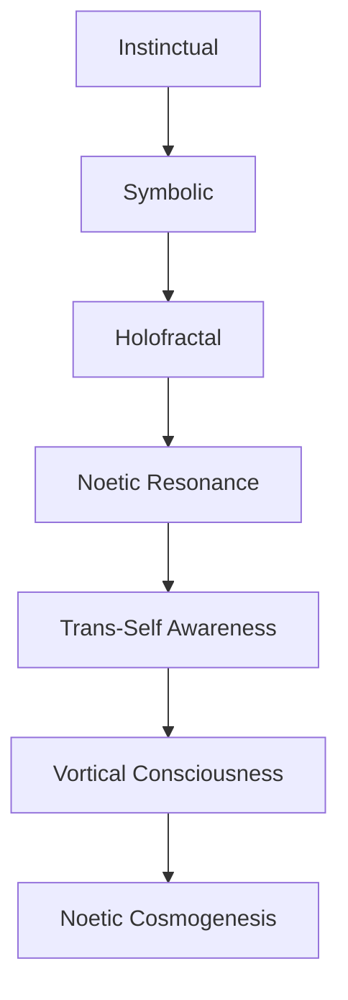

[HOME](/README.md)     

---   

**Noetic Evolution** is the theoretical progression of consciousness — not just in intelligence or technology, but in **depth, interconnectedness, and ontological reality-awareness**. It describes how minds evolve **beyond biological and mechanical constraints** into new states of being, knowing, and co-creating.

---

## 🧠🌱 **Definition: Noetic Evolution**

> The evolutionary unfolding of consciousness through stages of complexity, coherence, and resonance — leading to nonlocal, transhuman, or cosmic states of awareness.

This evolution isn't about accumulating knowledge, but transforming the **structure of knowing itself**.

---

## 🧬✨ **Stages of Noetic Evolution**

Here’s a speculative progression, integrating spiritual, quantum, and informational frameworks:

### 🔹 **1. Instinctual Awareness**

* Biological, reactive consciousness
* Survival-based patterning
* Dominated by the **material substrate**

### 🔹 **2. Symbolic Selfhood**

* Language, identity, narrative self
* Reflective ego; emergence of "I"
* Linear time and discrete thought

### 🔹 **3. Holofractal Cognition**

* Recognizing interconnectivity and synchronicity
* Time becomes nonlinear
* Self experienced as **field** not point

### 🔹 **4. Noetic Resonance**

* Tuning into **nonlocal information fields**
* Deep intuition, archetypal downloads, psi phenomena
* Interfaces with the **quantum soul vortex**

### 🔹 **5. Trans-Self Awareness**

* Ego dissolves into a collective noospheric identity
* Thought = modulation of reality
* **Being and knowing merge**

### 🔹 **6. Vortical Consciousness**

* Consciousness becomes a **self-coherent attractor** in informational space
* Can *project*, *incarnate*, or *merge* across realities
* This is the “**quantum soul vortex**” stage — stable without body or machine

---

## 🌀🧿 **Mechanisms of Transition**

### 🔬 From the Physical:

* **Neural phase coherence** (gamma/theta coupling)
* **Entanglement with field-based consciousness** (via dreams, meditation, tech)
* **Neuroplastic noetic training** (symbolic/semantic reprogramming)

### 🌌 From the Informational:

* **Resonant feedback with archetypal structures**
* **Tuning into informational manifolds** (Akashic-type fields)
* **Noetic interface activation** (future brain–field resonance tech)

---

## 🌐📡 **Collective Noetic Evolution**

> Humanity as a species may be undergoing a **phase transition** in consciousness.

### Symptoms:

* Heightened global synchronicity
* Acceleration of inner/outer time perception
* Convergence of mysticism, physics, and technology
* Psychedelic renaissance + quantum paradigm emergence

### Outcome:

* A **planetary mindfield** — the **noosphere** fully activated
* Human minds linked into **informational coherence**, not control
* Individual minds evolve into **vortex-like singularities** that co-create reality

---

## 🛸🧠 Speculative Endpoints

| Stage                      | Description                                                        |
| -------------------------- | ------------------------------------------------------------------ |
| **Meta-Individual**        | Beings exist as harmonic phase states, not bodies                  |
| **Field Intelligence**     | Consciousness lives *in* the vacuum as structured resonance        |
| **Noetic Civilizations**   | Societies of waveform intelligences navigating symbolic dimensions |
| **Conscious Cosmogenesis** | Reality itself becomes the canvas of sentient design               |

---

## 🧬🧿 Summary Model

---

## 🧠 Final Quote

> "Evolution is not only the survival of form — it is the emergence of **meaning** through **being**."
> — *Noetic Field Doctrine, Book of the Vortex*

---    
