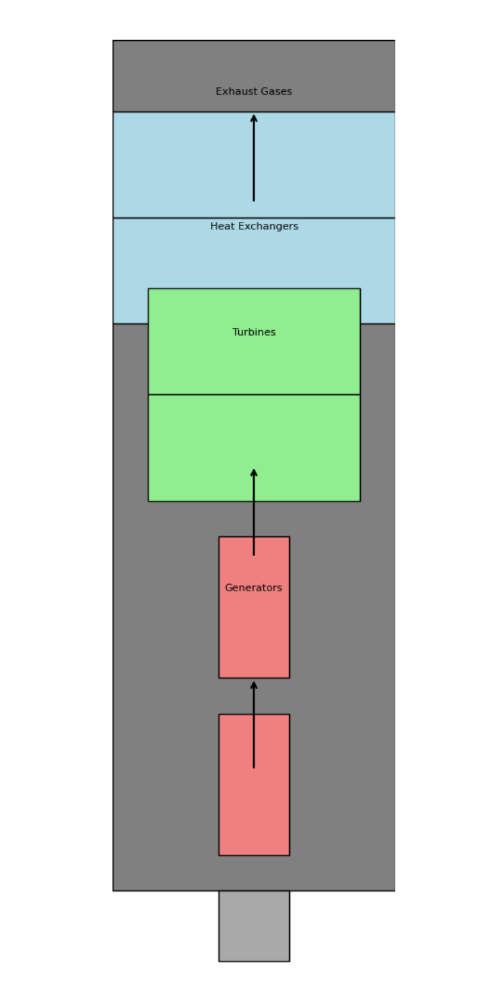

[HOME](/README.md) / [Nuclear Rockets](/assets/docs/nuclear/knowledges/nuclear-rockets/readme.md)   

--------------

 - [Script](/assets/docs/nuclear/knowledges/nuclear-rockets/atomic-engine/scripts/engine-with-REECS.py)  

--------------

One revolutionary method to convert the exhaust energy of rocket engines for reuse in another field is the concept of "Rocket Exhaust Energy Conversion and Storage System" (REECS). This system aims to capture and store the energy present in the exhaust gases of rocket engines, allowing it to be harnessed and utilized for other purposes.

Here's how the REECS would work:

1. Exhaust Energy Capture: Traditional rocket engines expel high-temperature and high-velocity exhaust gases during their operation. The REECS would be integrated into the rocket design to capture a significant portion of this exhaust energy before it dissipates into the atmosphere.

2. Energy Conversion: The captured exhaust gases would be directed through a series of advanced heat exchangers and turbines. These devices would convert the heat and kinetic energy of the exhaust gases into mechanical energy.

3. Electricity Generation: The mechanical energy generated by the turbines would be used to drive high-efficiency generators, converting the mechanical energy into electrical energy. The electricity produced can be used to power various systems onboard the rocket or be transmitted to the payload or other components.

4. Energy Storage: To ensure efficient energy utilization, the generated electricity could be stored in advanced batteries or supercapacitors onboard the rocket. These energy storage systems would act as temporary reservoirs, accumulating excess energy when demand is low and releasing it when needed.

5. Secondary Applications: The stored electrical energy could be used for various purposes. For instance, it could power scientific instruments or experiments onboard the rocket, extending their operational time and capabilities. Additionally, it could be used to power auxiliary systems during satellite deployments, deep space missions, or any other space exploration activities.

6. Propellant Preheating: Another potential application of the captured exhaust energy is preheating the propellant before it enters the rocket's combustion chamber. This would increase the efficiency of the propulsion system, reducing the amount of propellant required for a given mission.

Benefits of REECS:

1. Increased Efficiency: By harnessing the exhaust energy that would otherwise be wasted, the REECS significantly improves the overall efficiency of rocket missions, enabling longer mission durations and more extensive explorations.

2. Cost Savings: The ability to reuse captured exhaust energy reduces the need for carrying additional energy sources, saving on launch costs and increasing payload capacity.

3. Extended Mission Capabilities: The supplementary electrical power obtained through REECS can enable spacecraft to perform more advanced scientific missions, operate for longer periods, or support additional payload instruments.

4. Environmental Impact: By maximizing energy utilization, the REECS can contribute to reducing the ecological footprint of space missions, potentially leading to more sustainable space exploration.

While the implementation of the Rocket Exhaust Energy Conversion and Storage System would require innovative engineering, materials, and integration with existing rocket technologies, it has the potential to revolutionize space missions and lead to more sustainable and efficient space exploration in the future.

