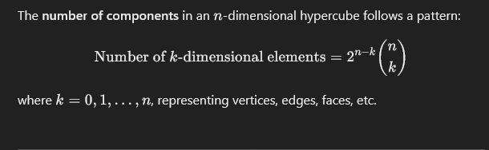

[HOME](/README.md)   

---   

    
   

---

### **Polytopes**

A **polytope** is the generalization of polygons (2D) and polyhedra (3D) into \(n\)-dimensional space. They are defined by:  
- **Vertices** (points)  
- **Edges** (lines connecting vertices)  
- **Facets** (higher-dimensional analogs of faces)  

Examples of polytopes:  
- **Simplex:** The \(n\)-dimensional equivalent of a triangle. A 3D simplex is a tetrahedron.  
- **Hypercube:** Generalized cube.  
- **Cross-Polytope:** Dual to the hypercube; in 3D, this is the octahedron.  
- **Regular Polytopes:** Analogous to Platonic solids, having symmetric structure.

#### Importance:
Polytopes help in:
- **Geometry:** Exploring higher-dimensional spaces.  
- **Optimization:** Convex polytopes are used in linear programming.  
- **Physics & Visualization:** Understanding multi-dimensional systems.  

---   
